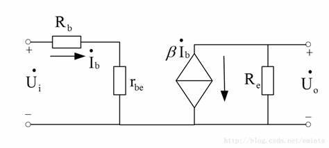
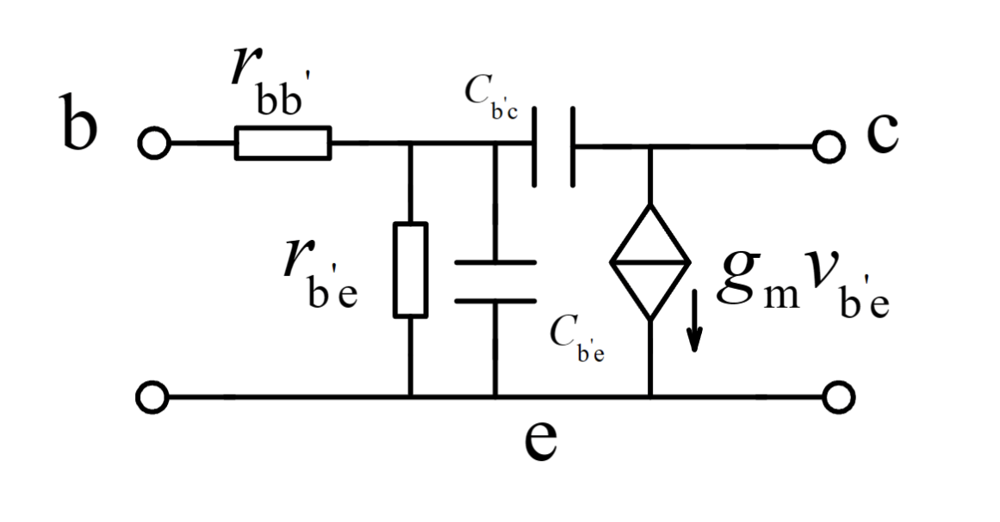
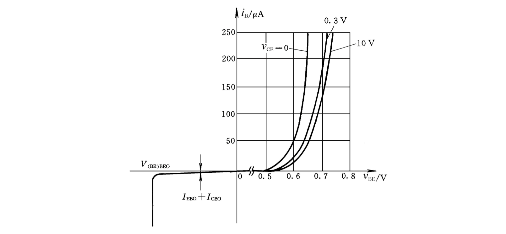
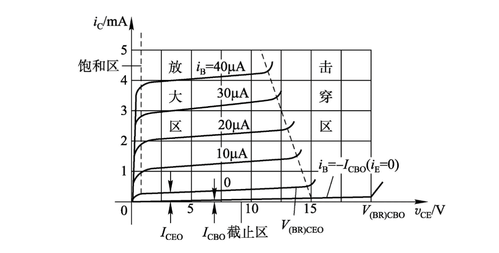
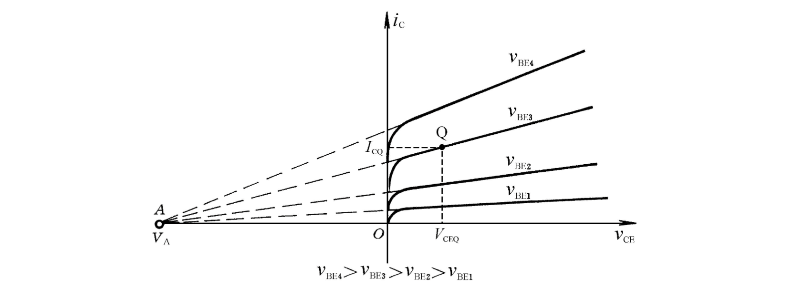
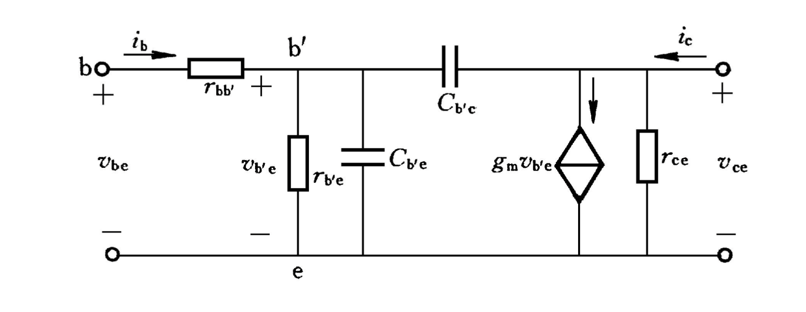

# 晶体三极管模型

## 埃伯斯-摩尔模型

不怎么用

## 等效电路模型

### 大信号等效电路

**三种组态**：

共基组态：只有$B$接高电压，$E$接低电压，才能工作。

共发组态：$B$端为输入，$C$端为输出，$I_B + I_C =I_E$，主要用于电路放大，是最常用的组态

共集电极：

判断组态：**分析交流小信号，谁接地就是什么组态**

**三种工作模式**

工作模式与三极管的组态没有关联，只与在三极管上加的电压有关。

1.**放大模式**：
$$
I_C = \beta I_B
$$
2.**饱和模式**：两个结均正偏，失去正向受控作用，将两个结等效为两个导通电压，且
$$
V_{BE(sat)} = 0.7V \quad V_{CE(sat)}=0.3V
$$
3.**截止模式**：$be$和$ce$都开路，$I_B = 0$，$I_C= 0$

### 小信号等效电路

小信号等效电路只学共发组态、放大模式下的等效电路

分析小信号要把$V_{CC}$接地，电容短路

三极管基极和发射极之间是一只等效二极管，根据二极管小信号等效模型，可以等效为一只线性电阻，记为$r_{be}$，由二极管计算肖特基电阻的公式可得：
$$
r_{be} = (1+ \beta) \frac{V_T}{I_{EQ}}=(1+ \beta)r_e
$$
这就是三极管的输入电阻。其中$r_e = \frac{V_T}{I_{EQ}}$ 为基极和发射极之间真实存在的肖特基电阻。

同时，对于小信号，
$$
i_c = \beta i_b
$$
考虑基的区体电阻，将$r_{be}$写成$r_{b{'}e}$，从基极到发射极就应该有两个电阻，基区体电组$r_{bb{'}}$和肖特基电阻$r_{b{'}e}$，基区体电阻较小，约几十欧，通常不考虑，如果要考虑，$r_{bb{'}}$是已知的，因为它与工艺有关。

 $i_c = g_m v_{b{'}e}$，其中，$v_{b{'}e}$是输入端的电压（$r_{bb{'}}$右边点），$g_m$称为跨导
$$
g_m = \frac{\beta}{r_{b{'}e}} =\frac{\alpha}{r_e} = \frac{I_{CQ}}{V_T} = 38.5I_{CQ}
$$
三极管有两种控制形式，电流控制电流，电压控制电流，本质是电压控制。

### 高频小信号等效电路

基极和发射极之间是扩散电容，基极和集电极之间是势壁电容，扩散电容要大于势垒电容

## 曲线模型

### 输入特性

$V_{CE}$增大，曲线向右移动，$0\sim3V$之间变化较大，因为这时三极管工作在饱和模式，$V_{CE}$越小，饱和越深，发射区漂移到集电区的电子越少，在基区复合的机会越大，$i_B$越大， $V_{CE}>0.3V$之后曲线变化很小，三极管工作在放大模式，$i_B$不随$V_{CE}$变化。但是当$V_{B}$一定时，$V_{CE}$增大，$V_{CB}$增大，基区宽度减小，发射区扩散来的电子复合机会减小，$I_B$减小，曲线右移（基区宽度调制效应）。

### 输出特性

输出特性曲线可分为四个区域：饱和、放大、截止、击穿

|  区域  |                             条件                             |                             特点                             |
| :----: | :----------------------------------------------------------: | :----------------------------------------------------------: |
| 饱和区 | $V_{BE}>0.7V, \quad V_{CE}<0.3V$ 发射结正偏，集电结反偏 | $I_{C}$不受$I_{B}$控制，而受$V_{CE}$影响， $I_{E}$略增，$I_{C}$显著增加 |
| 放大区 | $V_{BE} \geq 0.7V, \quad V_{CE}\geq 0.3V$ 发射结正偏，集电结反偏 | 具有正向受控作用，满足$I_{C}=\beta I_B$， $V_{CE}$增大，曲线略上翘 |
| 截止区 | $V_{BE} \leq 0.5V, \quad V_{CE}\geq 0.3V $ 发射结反偏，集电结反偏 |            $I_{C}\approx 0,\quad I_{B}\approx 0$             |
| 击穿区 |                $V_{CE}$非常大，集电结反向击穿                |                   $I_C$急剧增大，雪崩击穿                    |

将不同$V_{BE}$对应的输出特性曲线反向延长，将近似交于一点$A$上，$A$点对应的电压用$V_A$表示，称为厄尔利电压，$|V_A|$越大，曲线上翘程度越小。

由于基区宽度调制效应，可以引入一个电阻$r_{ce}$
$$
r_{ce} = \frac{|V_A|}{I_{CQ}}
$$
混合$\pi$型等效电路将做出相应修正

