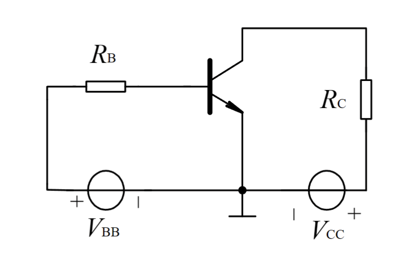
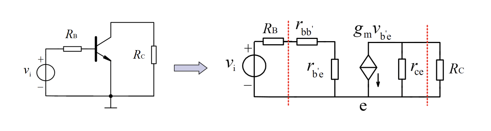

# 等效电路分析法

## 直流

用大信号等效模型，算出$I_{CQ}$、$V_{CEQ}$（检查是否到饱和区）

$$I_B = \frac{V_{BB}-V_{BE(on)}}{R_B}\\I_C = \beta I_B \\V_{CE} = V_{CC}-I_CR_C$$

$R_D$可以忽略不计

## 交流

用小信号等效电路

在$b,e,b$处将管子断开，带入混合$\pi$型等效电路

$r_{b^{'}e}$，$g_m$，$r_{ce}$这些都和工作点电压有关

