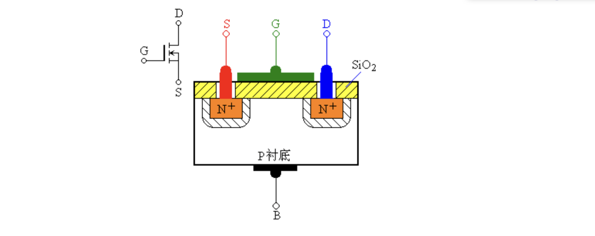
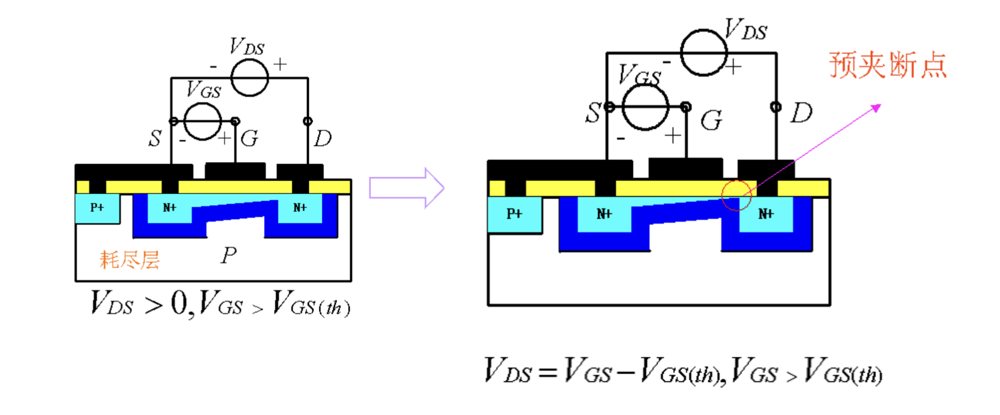
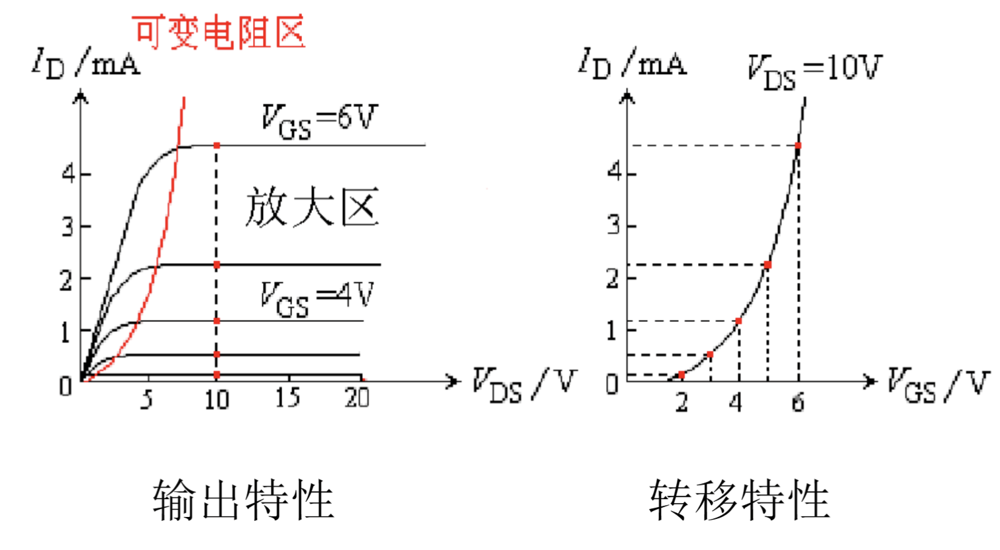
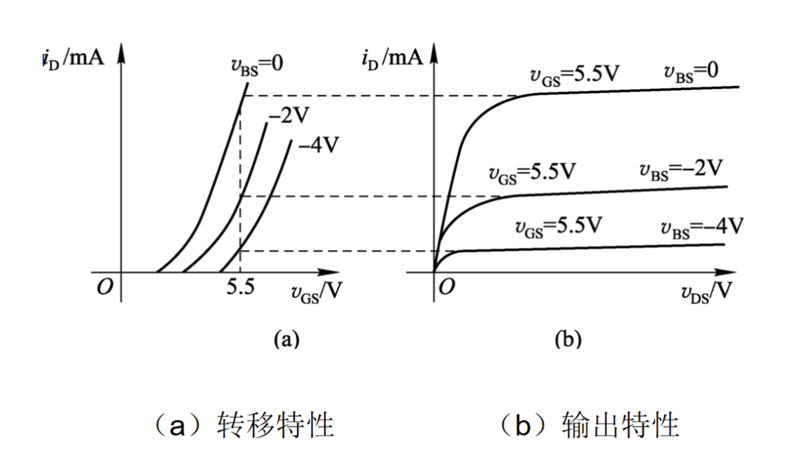
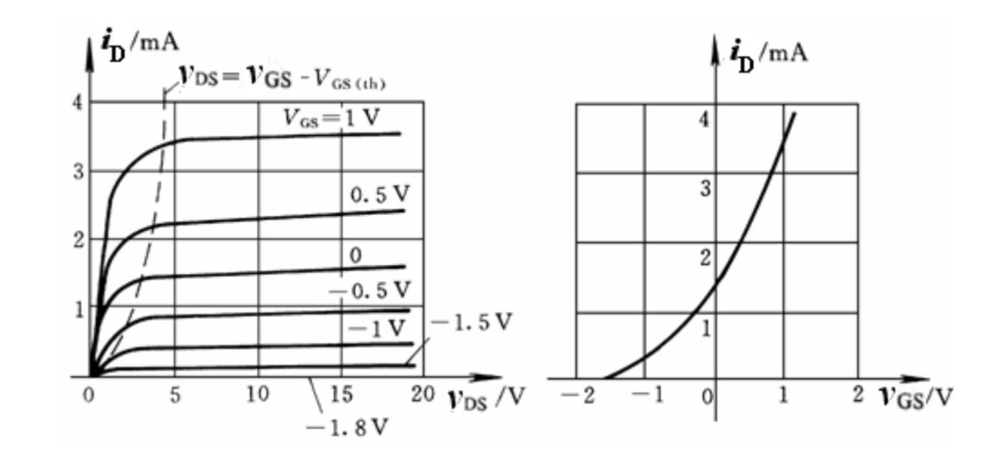
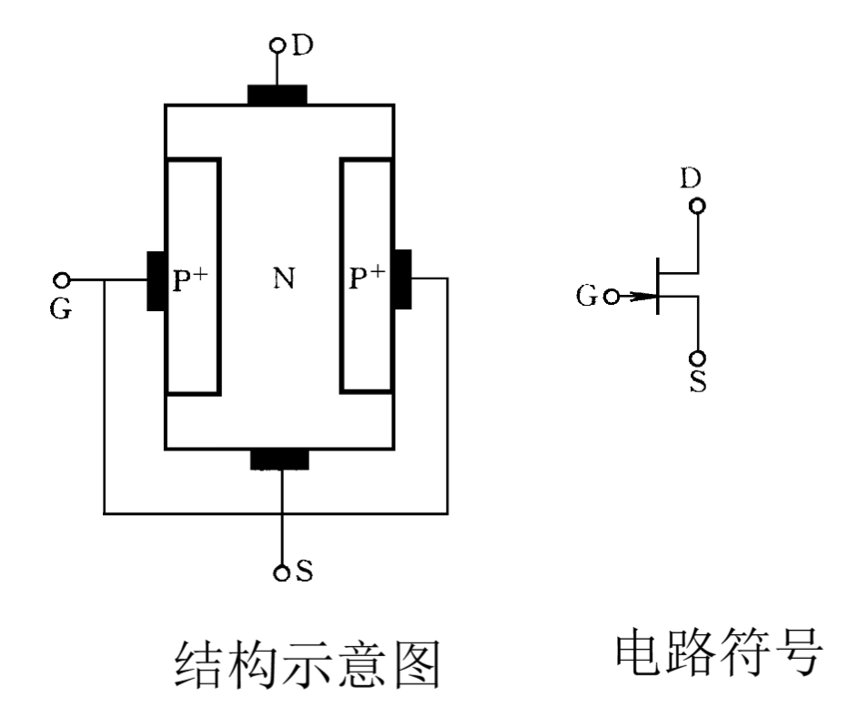
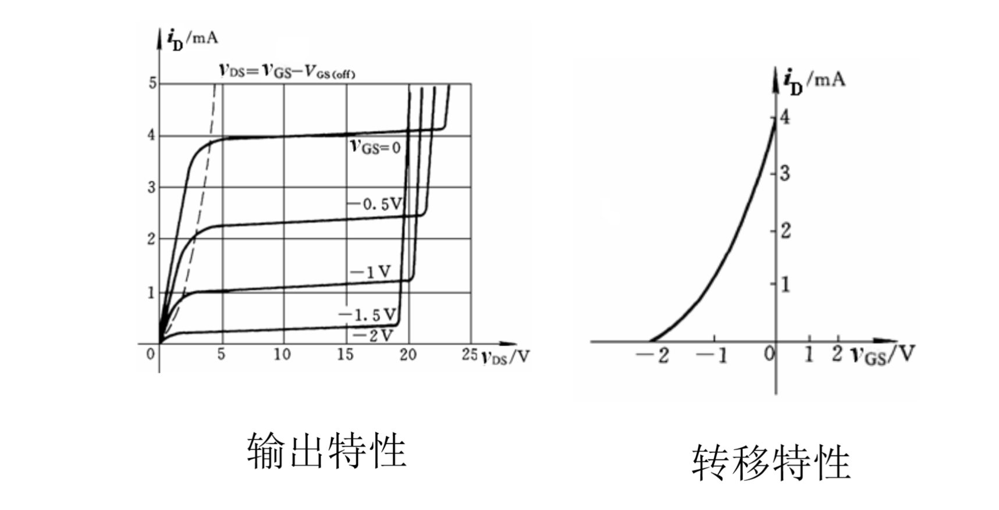

# 场效应管

场效应管工作仅取决于多子，是单极性器件

## 电路符号

栅极对应基极，源极对应发射极，漏极对应集电极，电路符号上，栅极偏向原极

箭头指向$N$型半导体，也表示电子流动方向

## 工作原理

以$N$沟道增强型为例。为了使$PN^{+}$结反偏，衬底接在最低电位，源极接衬底。在$S$和$G$之间加上电压$V_{GS}$，随着$V_{GS}$增大，两个$N^+$区和衬底的电子会吸向衬底表面，填充$P$区的空穴，在表面形成负离子，并与两个$PN^+$结的阻挡层相连通，再增大$V_{GS}$，直到负离子区自由电子浓度大于空穴，使源极和漏极之间形成导电沟道（电子导电），称为反型层。此时外加正值$V_{DS}$时，源区的电子会通过导电沟道漂移到漏极区。

将开始形成反型层所需的电压$V_{GS}$称为开启电压，用$V_{GS(th)}$表示。当$V_{GS}$小于$V_{GS(th)}$时，$i_{D}$并不会突变到0，而是与$V(GS)$之间服从指数关系，这个区域称为弱反型层区。

在$V_{DS}$很小且不变时，当$V_{GS}$增大，$V_{GS}$沟道加深，电阻减小（压控电阻）。场效应管输出曲线原点附近的曲线为线性的。

控制$V_{GS}$不变，沟道可以看成一个个电阻串联起来，所以栅极到漏极的压降
$$
V_{GD} = V_{GS}-V_{DS}
$$
增大$V_{DS}$，$V_{GD}$减小。当$V_{GD}$减小到$V_{GS(th)}$，在近漏端就会产生夹断，电阻增大。这种夹断与前面的全部夹断不同，前面的导电，但是这种夹断可以导电，称为预夹断。

再增加$V_{GD}$，多出来的电压都会加在夹端点上，沟道中的电流基本不变，这个电流称为饱和电流。

实际上当$V_{DS}$增大时，夹断点会向源极移动，源极一侧沟道加深，电阻减小，电流增大。称为沟道长度调制效应。

## $EMOS$场效应管的特性

场效应管也有三种连接方式：共源、共栅、共漏，分别对应三极管的共发、共基、共集。$MOS$管的伏安特性也可以用输入曲线和输出曲线来表示，但是$MOS$管的输入电流是栅极电容板的充放电电流，静态时基近似为0，因此再共源连接时不考虑输入特性，而研究输出特性和转移特性。

### 输出特性

输出特性曲线分为四个区非饱和区、饱和区、截止区和击穿区。

$V_{GS}<V_{GS(th)}$并且$V_{DS}<V_{GS}-V_{GS(th)}$时处在非饱和区，$V_{GS}<V_{GS(th)}$并且$V_{DS}<V_{GS}-V_{GS(th)}$时，产生预夹断，进入饱和区。$V_{GS}<V_{GS(th)}$时，导电沟道未形成，$i_D = 0$，截止区。当$V_{DS}$过大时，预夹断点移动到源区，直接将电子拉到漏区，或者是因为$V_{GS}$过大，引发$SiO_2$绝缘层击穿，击穿区。

### 衬底效应

当源极没有与栅极相连时，会产生负值电压$V_{BS}$，相当于在$PN^{+}$结上加上反偏电压，阻挡层宽度增加，使得$V_{GS(th)}$增大，当$V_{GS}$不变时，$V_{BS}$增大，$i_D$减小。所以$V_{BS}$对$i_D$也有控制作用，但是比$V_{GS}$的作用小的多，又称衬底为背栅极。

## $DMOS$

在制作时就有沟道，电路符号与$EMOS$不同的是，虚线用实线代替。增大$V_{GS}$时，沟道加深，$V_{GS}$减小，沟道变浅，$V_{GS}<V_{GS(th)}$时，沟道消失，此时$V_{GS}$为负值。

## 结型管

### 结构

两个$P^+$区连在一起作为栅极。$PN$结需要反偏，反偏电压增加，阻挡层宽度增加，增加到一定大小时，两边空间电荷区靠在一起，沟道夹断，这个电压称为$V_{GS(off)}$。

如果给管子加上$V_{DS}$，和$EMOS$类似，$V_{GD}=V_{GS}-V_{DS}$，$V_{GS}$本身就是负的，当$V_{DS}$增加时，$V_{GD}$增加，阻挡层宽度增加，靠近$D$处的阻挡层变窄，当$V_{GD} = V_{GS(off)}$，近漏端夹断。结型场效应管同样也有沟道长度调制效应。

### 特性

虚线左边是非饱和区，虚线右边是饱和区，又叫放大区，$i_D = 0$对应$V_{GS(off)}$，当$V_{DS}$达到某一值时，管子会击穿，$V_{GS}$绝对值约大，击穿所需$V_{DS}$的值越小。

如果输出特性坐标$V_{GS}$是负的，那就是$P$沟道管。

## 等效电路

### 大信号等效电路

$$
I_D = \frac{\mu_n C_{ox}W}{2l}(V_{GS}-V_{GS(th)})^2\\ I_g = 0
$$
若考虑沟道长度调制效应（做题一般不考虑），上式修正为
$$
I_D = \frac{\mu_n C_{ox}W}{2l}(V_{GS}-V_{GS(th)})^2(1-\frac{V_{DS}}{V_A}) = \frac{\mu_n C_{ox}W}{2l}(V_{GS}-V_{GS(th)})^2(1+\lambda V_{DS})
$$
其中$\lambda=-\frac{1}{V_A}$，称为沟道长度调制系数，$V_A$由工艺决定。

### ~~小信号等效电路~~

$$
i_d=g_m v_{gs}+\frac{v_{ds}}{r_ds}\\
g_{m} = 2\frac{\mu_n G_{ox}W}{2l}(V_{GS}-V_{GS(th)})= 2\sqrt{\frac{\mu_n G_{ox}W}{2l}I_{DQ}}
$$

~~其中$V_{GS} = V_{GSAQ}$~~

## 四种场效应管比较

|  类型   |      电路符号      |           转移特性            |
| :-----: | :----------------: | :---------------------------: |
| $NEMOS$ | 箭头向内，中间虚线 |     $V_{GS}>0$，曲线上升      |
| $NDMOS$ | 箭头向内，中间实线 | $V_{GS}$可以小于$0$，曲线上升 |
| $PEMOS$ | 箭头向外，中间虚线 |   $V_{GS}$小于$0$，曲线下降   |
| $PDMOS$ | 箭头向外，中间实线 | $V_{GS}$可以大于$0$，曲线下降 |

如果$v_{GS}$与$V_{DS}$异号，则是$JEFT$

## 判断工作区域

| 区域                   | 条件                                               |
| ---------------------- | -------------------------------------------------- |
| 临界饱和工作条件       | $V_{GS}$使沟道开启，$|V_{DS}|=|V_{GS}-V_{GS(th)}|$ |
| 饱和区（放大区）条件   | $V_{GS}$使沟道开启，$|V_{DS}|>|V_{GS}-V_{GS(th)}|$ |
| 非饱和区（可变电组区） | $V_{GS}$使沟道开启，$|V_{DS}|<|V_{GS}-V_{GS(th)}|$ |

不管是$N$型还是$P$型，增强型还是耗尽型，上式都成立
