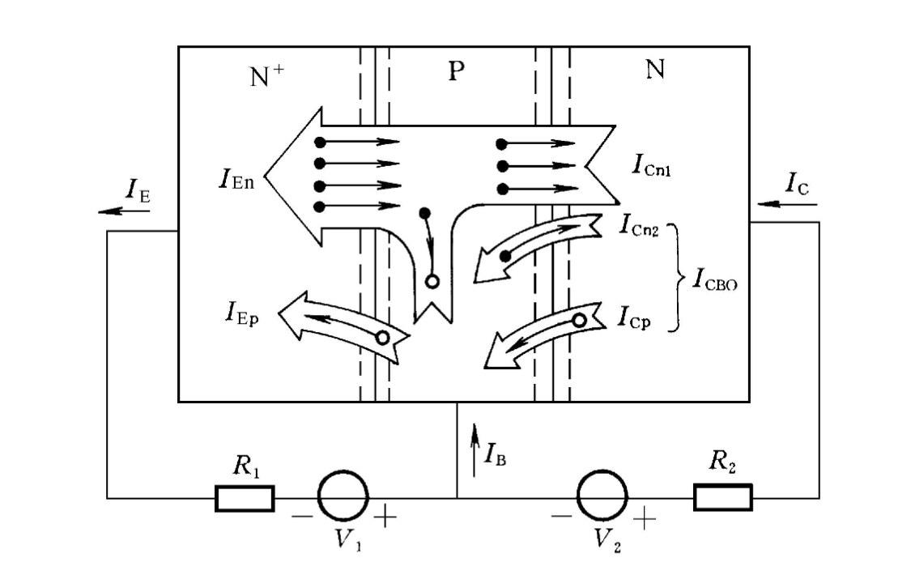
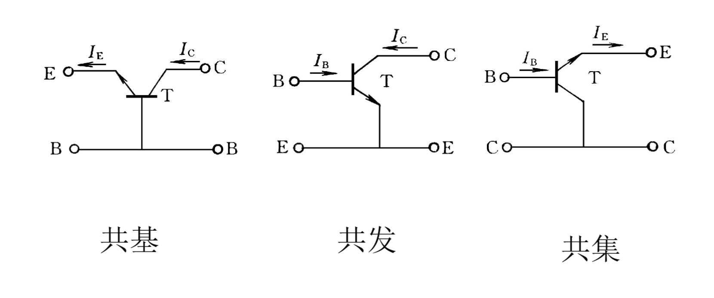

# 三极管工作原理

三极管有$NPN$和$PNP$型，两个类型的符号箭头指向不同。

箭头的方向指向$N$型半导体。箭头的第二个含义是电流的方向

从发射极发射出去的载流子在集电极杯被收集。
$$
I_E = I_B + I_C
$$
可以根据这个等式和箭头方向推断出另外两个电流的方向

一般给发射结加正偏，集电结加反偏，三极管具有正向受控作用，改变正偏电压，三个电流都会变化，而反偏电压变化，电流几乎不会变化

## 三极管工作原理

### 载流子传输过程

$N^{+}$表示参杂重

给发射结加上正偏，阻挡层宽度减小，扩散起主导作用，$N$型半导体的多子（电子）向$P$型扩散，$P$型半导体的多子（空穴）向$N$型扩散，发射结上形成扩散电流，外电路给它补充电子，外电路电流就是两个扩散电流的和
$$
I_E=I_{En}+I_{Ep}
$$
扩散的电子到了基区，会和基区的空穴复合掉一些，剩下的继续向集电结运动。

集电结加反偏，阻挡层宽度增加，电子在电场的作用下漂移到集电区。因为集电结加反偏，集电区的少子（空穴）会漂移到基区，基区的少子（电子）会漂移到集电区，两个电流形成集电结反向饱和电流$I_{CBO}$，$O$表示发射结开路时集电结的反向饱和电流。
$$
I_C=I_{C_{n1}}+I{C_{n_2}}=I_{C_{n1}}+I_{CBO}
$$
在$I_C$电流里，只有$I_{C_{n1}}$与发射结有关，$I_{CBO}$是不受控的。

基区
$$
I_B = I_{Ep}+(I_{En}-I_{Cn_1})-I_{CBO}
$$
其中$I_{En}-I_{cn_{1}} = I_{BB}$为复合电流

## 电流传输方程

### 三种连接方式

三种不同连接方式构成三种不同组态，具有不同特性，公共端是交流接地端，输入一般是基极或发射极，一般不用集电极作为输入端，输出可以从发射极或集电极输出，没有从基极输出	

### 传输方程

#### 共基极

输入为$ I_E$，输出为$I_C$

$\overline\alpha$为共基极电流传输系数，表示$I_E$转化为受控集电极电流$I_{cn1}$的能力
$$
\overline\alpha = \frac{I_cn1}{I_e}=\frac{I_C-I_{CBO}}{I_E}
$$
可以推出
$$
I_C = \overline\alpha I_E +I_{CBO}
$$
因为$I_{CBO}$远小于$I_E$，所以
$$
I_C \approx \overline\alpha I_E
$$
如果将集电极当作发射极，因为集电极是轻参杂，而且三极管在制作时，集电极面积较大，如果发射电子，发射极收集到的电子会很少，性能（$\overline\alpha$）会大大降低。

#### 共发射极

输入时$I_B$，输出为$I_C$

由$I_E = I_B + I_C$和$I_C=\overline\alpha I_E +I_{CBO}$，并定义$\overline\beta =\frac{\overline\alpha}{1-\overline\alpha}$可得
$$
I_C = \overline\beta I_B + I_{CEO}
$$
其中
$$
I_{CEO} = (1+\overline\beta)I_{CBO}
$$
$I_{CEO}$为穿透电流，表示基极开路时（下表没有$B$），集电极到发射极的直通电流（很小，即使乘上$(1+\overline\beta)$也很小），所以
$$
I_C \approx \overline\beta I_B
$$

#### 共集电极

输入时基极电流，输出是发射级电流
$$
I_E = (1+\overline\beta )I_B
$$
$I_{CEO}$忽略
