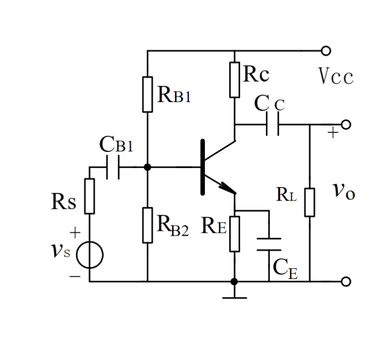
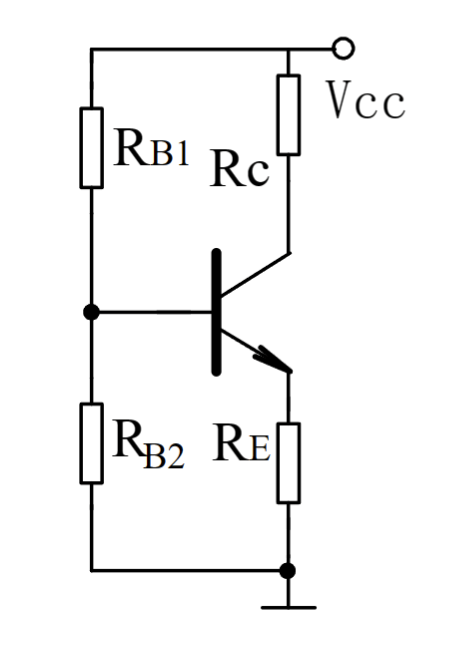
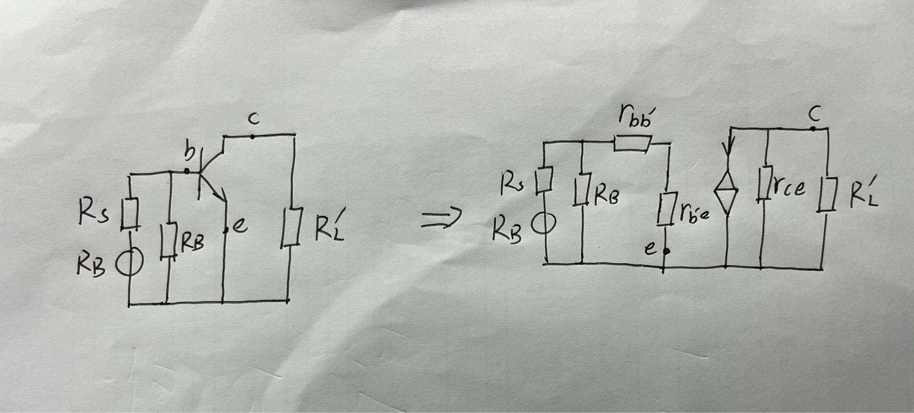

# 放大电路

## 电路组成

四个部分：偏置电路、信号源、负载、晶体管

负载：在负载上得到放大后的信号

偏置：$V_{CC}$， $R_{b1}$，$R_{b2}$，$R_{E}$构成分压式偏置电阻

耦合电容：信号可以通过，直流不能通过。

旁路电容：$C_E$容抗比$R_E$小得多

## 分析方法

先算直流再算交流

### 直流分析

（1）画出直流通路

所有电容开路，电感短路

（2）计算工作点电流

在b处和e处将电路断开，使用戴维南定理，求开路电压

$$V_{BB}=\frac{R_{B2}}{R_{B2}+R_{B1}}V_{cc}$$

短路内阻，$V_{cc}$短路到地：

$$R_B = R_{B1}//R_{B2}$$

在将得到的简化电路连接到三极管上，可以写出方程

$$V_{BB} = I_{B}R_{B} + V_{BE(on)}+ I_{E}R_E $$

又由$I_E = (1+\beta )I_B$，可以求出$$I_B = \frac{V_{BB} - V_{BE(on)}}{R_B+(1+\beta)R_E}，I_E = \frac{V_{BB}-V_{BE(on)}}{\frac{R_B}{1+\beta}+R_E}$$

大电流上的电阻转换到小电流上，乘上电流倍数；小电流上的电阻转换到大电流上，除以电流倍数

$\beta$足够大时$I_C = I_B$

$（1+\beta）R_E$时，$R_B$可忽略

最终目的是算出工作点电流$I_{CQ}$

### 交流分析

（1）画出交流通路

大电容短路，直流电源短路到地

因为$V_{cc}$短路到地，所以$R_{B1}$和$R_{B2}$两个电阻并联，$R_C$一段连接到地，发射极直接接地，$R_L$连接到集电极

令$$R_L^{'}= R_C//R_L$$

（2）代入小信号等效电路

在$b,e,c$三点，把三极管拿掉，代入小信号模型（注意$V_{ce}$,基区宽度调制）

可以将$R_B$，$R_S$，$V_b$这个回路用戴维南化简，但要注意用戴维南化简后得到的电压并不是$R_B$两端实际的电压

