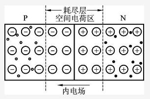
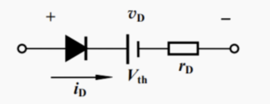
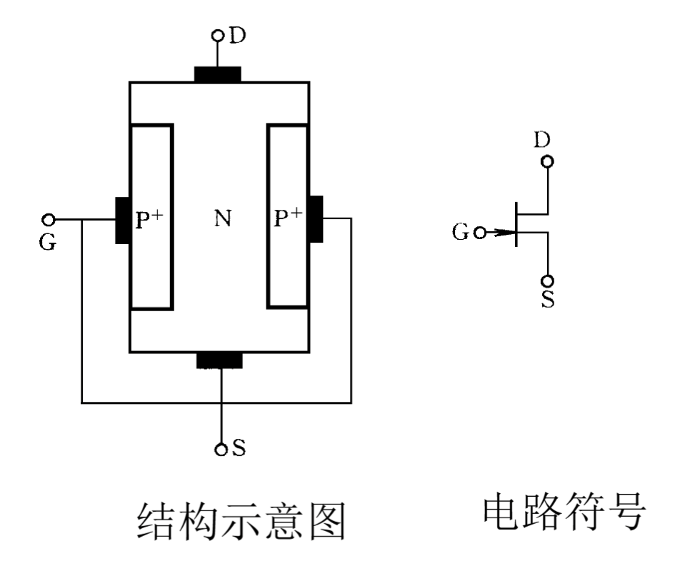
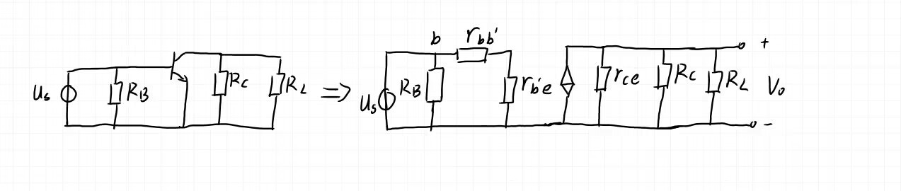
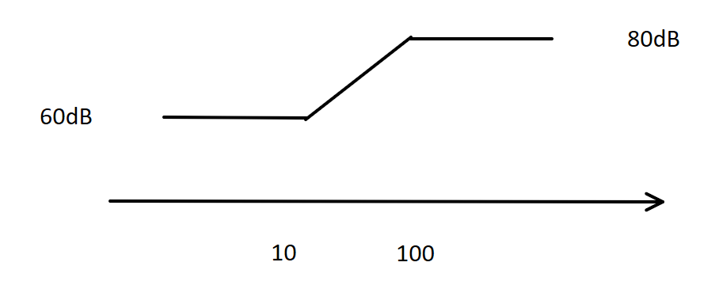
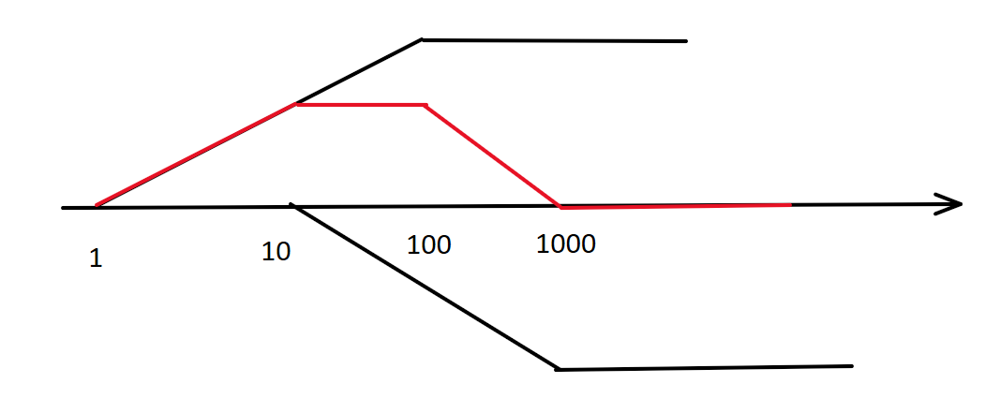
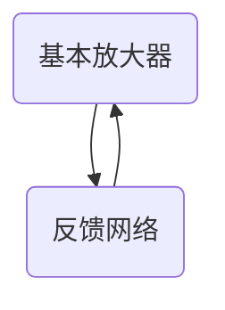

# 
<h1>二极管</h1>

## $PN$结

### 多子少子

$P$型半导体多子是空穴，$N$型半导体多子是电子

多子浓度取决于参杂浓度，少子浓度取决于温度

### **形成过程**

漂移运动是由电位差产生的载流子定向运动，扩散运动是由浓度差产生的载流子定向运动

$$
多子扩散\rightarrow 形成内建电场\rightarrow少子漂移\rightarrow扩散漂移动态平衡
$$

内建电场从$N$区指向$P$区，阻挡层任意一侧的宽度与改该侧的参杂浓度成反比

### **正向特性**

外电源正极接$P$极，负极接$N$极，正向电场削弱内建电场，少子漂移减少，主要由多子扩散产生电流，方向为$P \rightarrow N$

温度升高，多子扩散加剧，正向电流增大，在相同的电流下，电压减小，所以导通电压减小，$V_{D(on)}$减小。

### **反向特性**

外电源正极接$N$极，负极接$P$极，外加电场增强内建电场，少子漂移增强，主要由少子漂移产生电流，方向为$N\rightarrow P$，少子浓度远小于多子浓度，此时漂移电流是非常微小的，如果继续增大反向电压，忽略多子通过阻挡层，反向电流几乎全由少子漂移产生，因为少子浓度很小，此电流与外电压大小无关，称为反向饱和电流$I_s$

温度升高，激发出的少子浓度增加，反向饱和电流增加，$I_s$增大。

- 硅管的$V_{D(on)}$比锗管大，反向饱和电流比锗管小

### **击穿特性**

反向电流急剧增大的现象称为$PN$结的击穿

- **雪崩击穿**：参杂浓度较低，$E$较大，少子将共价键中的电子碰撞出来，温度升高，雪崩击穿所需电压升高，参杂浓度降低，击穿电压增大
- **齐纳击穿**：参杂浓度高，$E$比较小，内建电场将价电子从共价键中拉出来，温度升高，齐纳击穿所需电压降低，参杂浓度升高，击穿电压降低

### 稳压特性

$PN$结击穿后，电流变化很大，电压几乎不变，可以利用此特性制作稳压二极管。用$V_Z$表示稳压值，$I_Z$表示稳压时的电流。

但要注意使$I_{Zmin}<I_Z<I_{Zmax}$，前者使二极管被击穿，后者防止$PN$结不被烧坏。

## 电路分析方法

### 理想二极管

$V>0$导通，$V<0$断路

### 大信号模型

将导通后的二级管作为电压源，电压源的大小为开启电压$V_{on}$（又叫导通电压），$R_D$是二极管的体电阻，一般忽略

 

硅$PN$结：$V_{on} = 0.6\sim 0.8V$

锗$PN$结：$V_{on} = 0.2\sim 0.3V$

### 小信号模型

$r_j$是肖特基电阻，只在正向导通时有。$r_s$是中性区电阻，与$PN$结材质有关

$r_j$的大小为：
$$
r_j = \frac{V_T}{I_Q} = \frac{26}{I_Q}(\Omega)
$$

其中，$V_T = 26mV$，$I_Q$的单位为$mA$，$r_s$比$r_j$小很多，一般不考虑

需要注意的是，$R_D$和$r_s$不是同一个电阻，即使直流计算需要考虑了$R_D$，交流计算也需要考虑$r_s$

可以参考教材$P_{42}$ $1-19$题

## 稳压电路

$R$的作用是限流，输出电压$V_o=V_Z$，稳压管的稳压值。

为保证稳压管的电流小于$I_{Zmax}$，求$R$的最小值：

先求稳压管支路可能通过的最大电流，让$R_L \to \infty$，电流全部通过稳压管，再让$V_I$取最大值
$$
R_{min} =\frac{V_{Imax}-V_Z}{I_{Zmax}}
$$
为保证二极管可靠击穿，求$R_L$最小值（$R$取最小值）：

$R_L$取最小，一部分电流会通过$R_L$，通过$R$的电流：
$$
I = \frac{V_I - V_O}{R}
$$
通过$R_L$的电流
$$
I_L = I - I_{Zmin} = \frac{V_O}{R_L}
$$
可以得到
$$
R_L =\frac{V_o}{\frac{V_I - V_O}{R}-I_{Zmin}}
$$
要使$R_L$最小，可以使$V_I$最小。

## 限幅电路

**$D_1$导通，$D_2$截止**
$$
\left\{
\begin{matrix}
V_I - V_1 > 0 \\
-V_2 - V_I < 0
\end{matrix}
\right.
$$
得到$V_I > V_1$，此时$V_D = V_I - V_1$

**$D_1$截止，$D_2$导通**
$$
\left\{
\begin{matrix}
V_I - V_1 < 0 \\
-V_2 - V_I > 0
\end{matrix}
\right.
$$
得到$V_I < -V_2$，此时$V_D = -V_2 - V_I$

**$D_1$截止，$D_2$截止**
$$
\left\{
\begin{matrix}
V_I - V_1 < 0 \\
-V_2 - V_I < 0
\end{matrix}
\right.
$$
得到$-V_2<V_I<V_1$

**$D_1$导通，$D_2$导通**
$$
\left\{
\begin{matrix}
V_I - V_1 < 0 \\
-V_2 - V_I < 0
\end{matrix}
\right.
$$
$V_I$不存在

画出$V_o$关于$V_I$的图像

## 判断二极管是否导通

- 先假设所有二极管断开

- 再计算所有二极管两端电位
- 正向电位差最大的最先导通
- 再由上面的条件计算其他二极管是否导通

***

# 
<h1>三极管工作原理</h1>

三极管有$NPN$和$PNP$型，两个类型的符号箭头指向不同。

箭头有下面两个含义

- 指向$N$型半导体
- 电流的方向

从发射极发射出去的载流子在集电极被收集。
$$
I_E = I_B + I_C
$$
可以根据这个等式和箭头方向推断出另外两个电流的方向

一般给发射结加正偏，集电结加反偏，三极管具有正向受控作用，改变正偏电压，三个电流都会变化，而反偏电压变化，电流几乎不会变化

## 三极管工作原理

### 载流子传输过程

$N^{+}$表示参杂重

给发射结加上正偏，阻挡层宽度减小，扩散起主导作用，$N$型半导体的多子（电子）向$P$型扩散，$P$型半导体的多子（空穴）向$N$型扩散，发射结上形成扩散电流，外电路给它补充电子，外电路电流就是两个扩散电流的和
$$
I_E=I_{En}+I_{Ep}
$$
扩散的电子到了基区，会和基区的空穴复合掉一些，剩下的继续向集电结运动。

集电结加反偏，阻挡层宽度增加，电子在电场的作用下漂移到集电区。因为集电结加反偏，集电区的少子（空穴）会漂移到基区，基区的少子（电子）会漂移到集电区，两个电流形成集电结反向饱和电流$I_{CBO}$，$O$表示发射结开路时集电结的反向饱和电流。
$$
I_C=I_{C_{n1}}+I{C_{n_2}}=I_{C_{n1}}+I_{CBO}
$$
在$I_C$电流里，只有$I_{C_{n1}}$与发射结有关，$I_{CBO}$是不受控的。

基区
$$
I_B = I_{Ep}+(I_{En}-I_{Cn_1})-I_{CBO}
$$
其中$I_{En}-I_{cn_{1}} = I_{BB}$为复合电流

## 电流传输方程

### 三种连接方式

三种不同连接方式构成三种不同组态，具有不同特性，公共端是交流接地端，输入一般是基极或发射极，一般不用集电极作为输入端，输出可以从发射极或集电极输出，没有从基极输出	

### 传输方程

#### 共基极

输入为$ I_E$，输出为$I_C$

$\overline\alpha$为共基极电流传输系数，表示$I_E$转化为受控集电极电流$I_{cn1}$的能力
$$
\overline\alpha = \frac{I_cn1}{I_e}=\frac{I_C-I_{CBO}}{I_E}
$$
可以推出
$$
I_C = \overline\alpha I_E +I_{CBO}
$$
因为$I_{CBO}$远小于$I_E$，所以
$$
I_C \approx \overline\alpha I_E
$$
如果将集电极当作发射极，因为集电极是轻参杂，而且三极管在制作时，集电极面积较大，如果发射电子，发射极收集到的电子会很少，性能（$\overline\alpha$）会大大降低。

#### 共发射极

输入时$I_B$，输出为$I_C$

由$I_E = I_B + I_C$和$I_C=\overline\alpha I_E +I_{CBO}$，并定义$\overline\beta =\frac{\overline\alpha}{1-\overline\alpha}$可得
$$
I_C = \overline\beta I_B + I_{CEO}
$$
其中
$$
I_{CEO} = (1+\overline\beta)I_{CBO}
$$
$I_{CEO}$为穿透电流，表示基极开路（$I_B = 0$）时（下表没有$B$），集电极到发射极的直通电流（很小，即使乘上$(1+\overline\beta)$也很小），所以
$$
I_C \approx \overline\beta I_B
$$

#### 共集电极

输入时基极电流，输出是发射级电流
$$
I_E = (1+\overline\beta )I_B
$$
$I_{CEO}$忽略

***

# 
晶体三极管模型

## 埃伯斯-摩尔模型

不怎么用

## 等效电路模型

### 大信号等效电路

**三种组态**：

- 共基组态：只有$B$接高电压，$E$接低电压，才能工作。共基极放大电路只有电压放大作用，没有电流放大作用。
- 共发组态：$B$端为输入，$C$端为输出，$I_B + I_C =I_E$，主要用于电路放大，是最常用的组态。共射放大电路既有电压放大作用又有电流放大作用。
- 共集电极：只有电流放大作用，没有电压放大作用，输入电阻最高，输出电阻最小。

判断组态方法：**分析交流小信号，谁接地就是什么组态**

**三种工作模式**

工作模式与三极管的组态没有关联，只与在三极管上加的电压有关。

- **放大模式**：只有在放大模式下才有：

$$
I_C = \beta I_B
$$
- **饱和模式**：两个结均正偏，失去正向受控作用，将两个结等效为两个导通电压，且

$$
V_{BE(sat)} = 0.7V \quad V_{CE(sat)}=0.3V
$$
​						  判断电路处于饱和区最简便的方法是测量$V_{CE}<0.3V$

- **截止模式**：$be$和$ce$都开路，$I_B = 0$，$I_C= 0$

### 小信号等效电路

分析小信号要把$V_{CC}$接地，电容短路

三极管基极和发射极之间是一只等效二极管，根据二极管小信号等效模型，可以等效为一只线性电阻，记为$r_{be}$，由二极管计算肖特基电阻的公式可得：
$$
r_{be} = (1+ \beta) \frac{V_T}{I_{EQ}}=(1+ \beta)r_e = \beta\frac{V_T}{I_{CQ}}
$$
这就是三极管的输入电阻。其中，$I_{CQ}$的单位为$mA$，$r_e = \frac{V_T}{I_{EQ}}$ 为基极和发射极之间真实存在的肖特基电阻。

同时，对于小信号，
$$
i_c = \beta i_b
$$
考虑基的区体电阻，将$r_{be}$写成$r_{b{'}e}$，从基极到发射极就应该有两个电阻，基区体电组$r_{bb{'}}$和肖特基电阻$r_{b{'}e}$，基区体电阻较小，约几十欧，通常不考虑，如果要考虑，$r_{bb{'}}$是已知的，因为它与工艺有关。

 $i_c = g_m v_{b{'}e}$，其中，$v_{b{'}e}$是输入端的电压（$r_{bb{'}}$右边点），$g_m$称为跨导
$$
g_m = \frac{\beta}{r_{b{'}e}} =\frac{\alpha}{r_e} = \frac{I_{CQ}}{V_T} = 38.5I_{CQ}
$$
其中$I_{CQ}$的单位为$A$

三极管有两种控制形式，电流控制电流，电压控制电流，本质是电压控制。

### 高频小信号等效电路

基极和发射极之间是扩散电容，基极和集电极之间是势壁电容，扩散电容要大于势垒电容

## 曲线模型

### 输入特性

$V_{CE}$增大，曲线向右移动，$0\sim3V$之间变化较大，因为这时三极管工作在饱和模式，$V_{CE}$越小，饱和越深，发射区漂移到集电区的电子越少，在基区复合的机会越大，$i_B$越大， $V_{CE}>0.3V$之后曲线变化很小，三极管工作在放大模式，$i_B$不随$V_{CE}$变化。但是当$V_{B}$一定时，$V_{CE}$增大，$V_{CB}$增大，基区宽度减小，发射区扩散来的电子复合机会减小，$I_B$减小，曲线右移（基区宽度调制效应）。

### 输出特性

输出特性曲线可分为四个区域：饱和、放大、截止、击穿

|  区域  |                             条件                             |                             特点                             |
| :----: | :----------------------------------------------------------: | :----------------------------------------------------------: |
| 饱和区 | $V_{BE}>0.7V, \quad V_{CE}<0.3V$ 发射结正偏，集电结正偏 | $I_{C}$不受$I_{B}$控制，而受$V_{CE}$影响， $I_{E}$略增，$I_{C}$显著增加 |
| 放大区 | $V_{BE} \geq 0.7V, \quad V_{CE}\geq 0.3V$ 发射结正偏，集电结反偏 | 具有正向受控作用，满足$I_{C}=\beta I_B$， $V_{CE}$增大，曲线略上翘 |
| 截止区 | $V_{BE} \leq 0.7V, \quad V_{CE}\geq 0.3V $ 发射结反偏，集电结反偏 | $I_{C}\approx 0,\quad I_{B}\approx 0$ 由$I_B\approx 0 $定义 |
| 击穿区 |                $V_{CE}$非常大，集电结反向击穿                |                   $I_C$急剧增大，雪崩击穿                    |

判断电路处于饱和区最简便的方法是测量$V_{CE}<0.3V$

将不同$V_{BE}$对应的输出特性曲线反向延长，将近似交于一点$A$上，$A$点对应的电压用$V_A$表示，称为厄尔利电压，$|V_A|$越大，曲线上翘程度越小。

由于基区宽度调制效应，可以引入一个电阻$r_{ce}$
$$
r_{ce} = \frac{|V_A|}{I_{CQ}}
$$
混合$\pi$型等效电路将做出相应修正

***

# 
等效电路分析法

## 直流

用大信号等效模型，算出$I_{CQ}$、$V_{CEQ}$（检查是否到饱和区）

$$
\left\{
\begin{matrix}
I_B = \frac{V_{BB}-V_{BE(on)}}{R_B}\\
I_C = \beta I_B \\
V_{CE} = V_{CC}-I_CR_C
\end{matrix}
\right.
$$

$R_D$可以忽略不计

## 交流

用小信号等效电路

在$b,e,b$处将管子断开，带入混合$\pi$型等效电路

$r_{b^{'}e}$，$g_m$，$r_{ce}$这些都和工作点电压有关

***

# 
放大电路

## 电路组成

- 四个部分：偏置电路、信号源、负载、晶体管

- 负载：在负载上得到放大后的信号

- 偏置：$V_{CC}$， $R_{b1}$，$R_{b2}$，$R_{E}$构成分压式偏置电阻

- 耦合电容：信号可以通过，直流不能通过。

- 旁路电容：$C_E$，容抗比$R_E$小得多

## 分析方法

先算直流再算交流

### 直流分析

**1.画出直流通路**

所有电容开路，电感短路

**2.计算工作点电流**

在b处和e处将电路断开，使用戴维南定理，求开路电压

$$
V_{BB}=\frac{R_{B2}}{R_{B2}+R_{B1}}V_{cc}
$$

短路内阻，$V_{cc}$短路到地：

$$
R_B = R_{B1}//R_{B2}
$$

在将得到的简化电路连接到三极管上，可以写出方程

$$
V_{BB} = I_{B}R_{B} + V_{BE(on)}+ I_{E}R_E 
$$

又由$I_E = (1+\beta )I_B$，可以求出
$$
I_B = \frac{V_{BB} - V_{BE(on)}}{R_B+(1+\beta)R_E}，I_E = \frac{V_{BB}-V_{BE(on)}}{\frac{R_B}{1+\beta}+R_E}
$$

大电流上的电阻转换到小电流上，乘上电流倍数；小电流上的电阻转换到大电流上，除以电流倍数

$\beta$足够大时，$I_C = I_B$

$(1+\beta)R_E\gg R_B$时，$R_B$可忽略

最终目的是算出工作点电流$I_{CQ}$

### 交流分析

**1.画出交流通路**

大电容短路，直流电源短路到地

因为$V_{cc}$短路到地，所以$R_{B1}$和$R_{B2}$两个电阻并联，$R_C$一段连接到地，发射极直接接地，$R_L$连接到集电极

令$$R_L^{'}= R_C//R_L$$

**2.代入小信号等效电路**

在$b,e,c$三点，把三极管拿掉，代入小信号模型（注意$V_{ce}$,基区宽度调制）

可以将$R_B$，$R_S$，$V_B$这个回路用戴维南化简，但要注意用戴维南化简后得到的电压并不是$R_B$两端实际的电压

题目没说的话，$r_{bb^{'}}$忽略，$r_{ce}$当断路

## 波形失真

**线性失真**：波形中不产生其他频率的分量

对于下面的电路

| 类型     | 现象     | 解决办法             |
| -------- | -------- | -------------------- |
| 饱和失真 | 底部削平 | 增大$R_B$或减小$R_C$ |
| 截止失真 | 顶部削平 | 减小$R_B$或增大$R_C$ |

改善失真的基本原则：

调大$R_C$使得$U_{CE}$减小，更容易发生饱和失真，反之更容易发生截止失真。

调大$R_B$使得$I_B$减小，$I_C$也减小，$U_{CE}$增大，更容易发生截止失真，反之更容易发生饱和失真。

**具体原理可以看[这篇文章](https://zhuanlan.zhihu.com/p/623687941)**

***

# 
场效应管

场效应管工作仅取决于多子，是单极性器件（载流子只有一种），输入电阻$\gg$三极管输入电阻

## 电路符号

栅极对应基极，源极对应发射极，漏极对应集电极，电路符号上，栅极$G$偏向源极$S$

箭头有两层含义：

- 指向$N$型半导体
- 表示电子流动方向

## 工作原理

以$N$沟道增强型为例。为了使$PN^{+}$结反偏，衬底接在最低电位，源极接衬底。在$S$和$G$之间加上电压$V_{GS}$，随着$V_{GS}$增大，两个$N^+$区和衬底的电子会吸向衬底表面，填充$P$区的空穴，在表面形成负离子，并与两个$PN^+$结的阻挡层相连通，再增大$V_{GS}$，直到负离子区自由电子浓度大于空穴，使源极和漏极之间形成导电沟道（电子导电），称为反型层。此时外加正值$V_{DS}$时，源区的电子会通过导电沟道漂移到漏极区。

将开始形成反型层所需的电压$V_{GS}$称为开启电压，用$V_{GS(th)}$表示。当$V_{GS}$小于$V_{GS(th)}$时，$i_{D}$并不会突变到0，而是与$V(GS)$之间服从指数关系，这个区域称为弱反型层区。

在$V_{DS}$很小且不变时，当$V_{GS}$增大，$V_{GS}$沟道加深，电阻减小（压控电阻）。场效应管输出曲线原点附近的曲线为线性的。

控制$V_{GS}$不变，沟道可以看成一个个电阻串联起来，所以栅极到漏极的压降
$$
V_{GD} = V_{GS}-V_{DS}
$$
增大$V_{DS}$，$V_{GD}$减小。当$V_{GD}$减小到$V_{GS(th)}$，在近漏端就会产生夹断，电阻增大。这种夹断与前面的全部夹断不同，前面的导电，但是这种夹断可以导电，称为预夹断。

再增加$V_{GD}$，多出来的电压都会加在夹端点上，沟道中的电流基本不变，这个电流称为饱和电流。

实际上当$V_{DS}$增大时，夹断点会向源极移动，源极一侧沟道加深，电阻减小，电流增大。称为沟道长度调制效应。

## $EMOS$场效应管的特性

场效应管也有三种连接方式：共源、共栅、共漏，分别对应三极管的共发、共基、共集。$MOS$管的伏安特性也可以用输入曲线和输出曲线来表示，但是$MOS$管的输入电流是栅极电容板的充放电电流，静态时基近似为0，因此再共源连接时不考虑输入特性，而研究输出特性和转移特性。

### 输出特性

输出特性曲线分为四个区非饱和区、饱和区、截止区和击穿区。

- $V_{GS}<V_{GS(th)}$并且$V_{DS}<V_{GS}-V_{GS(th)}$时处在非饱和区。

- $V_{GS}>V_{GS(th)}$并且$V_{DS}>V_{GS}-V_{GS(th)}$时，产生预夹断，进入饱和区。

- $V_{GS}<V_{GS(th)}$时，导电沟道未形成，不管$V_{DS}$如何变化，都有$i_D = 0$，截止区。

当$V_{DS}$过大时，预夹断点移动到源区，直接将电子拉到漏区，或者是因为$V_{GS}$过大，引发$SiO_2$绝缘层击穿，击穿区。

### 衬底效应

当源极没有与栅极相连时，会产生负值电压$V_{BS}$，相当于在$PN^{+}$结上加上反偏电压，阻挡层宽度增加，使得$V_{GS(th)}$增大，当$V_{GS}$不变时，$V_{BS}$增大，$i_D$减小。所以$V_{BS}$对$i_D$也有控制作用，但是比$V_{GS}$的作用小的多，又称衬底为背栅极。

## $DMOS$

在制作时就有沟道，电路符号与$EMOS$不同的是，虚线用实线代替。增大$V_{GS}$时，沟道加深，$V_{GS}$减小，沟道变浅，$V_{GS}<V_{GS(th)}$时，沟道消失，此时$V_{GS}$为负值。

$PMOS$的输入输出特性曲线图像与$NMOS$是关于原点对称的，上半部分是$N$型，下半部分是$P$型，所以只需要记住$N$沟道的图像就可以了

## 结型管

### 结构

两个$P^+$区连在一起作为栅极。$PN$结需要反偏，反偏电压增加，阻挡层宽度增加，增加到一定大小时，两边空间电荷区靠在一起，沟道夹断，这个电压称为$V_{GS(off)}$。

如果给管子加上$V_{DS}$，和$EMOS$类似，$V_{GD}=V_{GS}-V_{DS}$，$V_{GS}$本身就是负的，当$V_{DS}$增加时，$V_{GD}$增加，阻挡层宽度增加，靠近$D$处的阻挡层变窄，当$V_{GD} = V_{GS(off)}$，近漏端夹断。结型场效应管同样也有沟道长度调制效应。

### 特性

虚线左边是非饱和区，虚线右边是饱和区，又叫放大区，$i_D = 0$对应$V_{GS(off)}$，当$V_{DS}$达到某一值时，管子会击穿，$|V_{GS}|$越大，击穿所需$V_{DS}$的值越小。

从上面的图像可以发现，$V_{DS}$与$V_{GS}$符号是相反的，从这一点可以判断一个管子是否是$JEFT$，$JEFT$工作在可变电阻区（非饱和区）或者恒流区（饱和区、放大区），前提是$|V_{GS}|<|V_{GS(th)}|$，即$P$型管应有$0<V_{GS}<V_{GS(th)}$，$N$型管应有$V_{GS(th)}<V_{GS}<0$

$P$沟道的输入输出特性曲线图像与$N$沟道的是关于原点对称的，上半部分是$N$型，下半部分是$P$型，所以只需要记住$N$沟道的图像就可以了

另外$P$沟道$V_{GS}$需大于零，保证$PN$结反偏

## 等效电路

### 大信号等效电路

$$
I_D = \frac{\mu_n C_{ox}W}{2l}(V_{GS}-V_{GS(th)})^2\\ I_g = 0
$$
若考虑沟道长度调制效应（做题一般不考虑），上式修正为
$$
I_D = \frac{\mu_n C_{ox}W}{2l}(V_{GS}-V_{GS(th)})^2(1-\frac{V_{DS}}{V_A}) = \frac{\mu_n C_{ox}W}{2l}(V_{GS}-V_{GS(th)})^2(1+\lambda V_{DS})
$$
其中$\lambda=-\frac{1}{V_A}$，称为沟道长度调制系数，$V_A$由工艺决定。

### ~~小信号等效电路~~

$$
i_d=g_m v_{gs}+\frac{v_{ds}}{r_ds}\\
g_{m} = 2\frac{\mu_n G_{ox}W}{2l}(V_{GS}-V_{GS(th)})= 2\sqrt{\frac{\mu_n G_{ox}W}{2l}I_{DQ}}
$$

~~其中$V_{GS} = V_{GSAQ}$~~

## 六种场效应管比较

|  类型   |               电路符号               |             转移特性             |
| :-----: | :----------------------------------: | :------------------------------: |
| $NEMOS$ |          箭头向内，中间虚线          |       $V_{GS}>0$，曲线上升       |
| $NDMOS$ |          箭头向内，中间实线          |  $V_{GS}$可以小于$0$，曲线上升   |
| $PEMOS$ |          箭头向外，中间虚线          |    $V_{GS}$小于$0$，曲线下降     |
| $PDMOS$ |          箭头向外，中间实线          |  $V_{GS}$可以大于$0$，曲线下降   |
| $NJEFT$ | 箭头向内，中间实线，$G$与$S$直接相连 | $V_{GS}<0$，$V_{GS}>0$，曲线上升 |
| $PJEFT$ | 箭头向外，中间实线，$G$与$S$直接相连 | $V_{GS}>0$，$V_{GD}<0$，曲线上升 |

## 判断工作区域

| 区域                   | 条件                                               |
| ---------------------- | -------------------------------------------------- |
| 临界饱和工作条件       | $V_{GS}$使沟道开启，$|V_{DS}|=|V_{GS}-V_{GS(th)}|$ |
| 饱和区（放大区）条件   | $V_{GS}$使沟道开启，$|V_{DS}|>|V_{GS}-V_{GS(th)}|$ |
| 非饱和区（可变电组区） | $V_{GS}$使沟道开启，$|V_{DS}|<|V_{GS}-V_{GS(th)}|$ |

不管是$N$型还是$P$型，增强型还是耗尽型，上式都成立

***

# 
基本放大器

## 放大器基本概念

### 放大的原理和实质

**符号**

直流用大写字母，交流用小写字母

**下标**

下表的两个字母代表两个点，有顺序，例如
$$
V_{BE} = -V_{EB}
$$

直流用大写，交流用小写，瞬时信号符号大写下标小写
$$
v_{BE} = V_{BE}+v_{be}
$$
**原理**

$$
v_{BE} = V_{BB}+v_{be}\\
i_B = I_{BQ}+I_{bm}
$$
由此可以写出
$$
i_C = \beta i_b = \beta I_{BQ}+\beta i_b = I_{CQ}+I_{cm}sin\omega t\\
v_{CE} = V_{CC}-i_{C}R_{L}=V_{CC}-I_{CQ}R_L-I_{cm}R_Lsin\omega t
$$
其中$-I_{CQ}-I_{cm}R_Lsin\omega t = -V_{om}sin\omega t=v_o$是交流信号$v_s$在放大器作用后输出的信号。只要$R_L$足够大，输出信号振幅$V_{om}$就有可能大于输入信号振幅$V_{sm}$

下面进行功率分析：

发射结消耗功率：
$$
P_I = \frac{1}{2\pi}\int_0 ^ {2\pi} v_{BE}i_Bd\omega t=V_{BB}I_{BQ} + \frac{1}{2}V_{sm}I_{bm}
$$
电源$V_{CC}$提供功率：
$$
P_D = \frac{1}{2\pi}\int_0^{2\pi}V_{CC}i_C d\omega t=V_{CC}I_{CQ}
$$

负载$R_L$上得到的功率：
$$
P_L = \frac{1}{2\pi}\int_0^{2\pi}i^2_CR_L d\omega t =v_O i_C= I^2_{CQ}R_L+\frac{1}{2}I^2_{cm}R_L
$$

其中$v_{o} = - i_CR_L$

加到三极管上的电压：
$$
P_C = \frac{1}{2\pi}\int_0^{2\pi}i_C v_{CE} d\omega t = V_{CC}I_{CQ}-I^2_{CQ}R_L-\frac{1}{2}I^2_{cm}R_L
$$
根据上面的式子，可以得到：
$$
P_D = P_L + P_C
$$
上面分析表明，$V_{CC}$保证了三极管工作在放大区，而且也是提供能量的电源，小信号放大所需的能量来自$V_{CC}$。三极管起到能量转换器的作用，即将$V_{CC}$提供的部分功率转换为输出信号的功率。

### 放大器的性能指标

规定电流以流入为正，电压上正下负

#### 一、输入电阻、输出电阻

放大器可以看作有源四端网络

当信号源内阻很大时，可以看成电流源，内阻很小时，可以看成电压源。

**输入电阻$R_i$**

对于输入信号，放大器可以看作负载。用等效电阻$R_i$表示
$$
R_i = \frac{v_i}{i_i}
$$
$R_i$ 越大，放大器输入端口得到的电压信号越大。$R_i$越小输入端口得到的电流信号越小。若此放大器的前面是另一极放大器，$R_i$是前一极的负载。

**输出电阻$R_o$**

从放大器的的输出端向放大器看去，考虑到信号源的内阻，将输出电阻定义修正为，在独立电压源开路$v_s = 0$或独立电流源开路$i_s=0$时，保留信号源内阻，由$R_L$两端向放大器看进去的等效电阻。可以用戴维南定理将电路简化
$$
R_o = - \frac{v_{ot}}{i_{on}}
$$
其中，$v_{ot}$是$R_L$断路，$v_i$或$i_i$在放大器输出端产生的开路电压，$i_{on}$是将$R_L$短接，$v_i$或$i_i$在输出端产生的短路电流。

#### 二、增益

增益又被称为放大倍数，用$A$表示，定义为放大器输出量与输入量的壁比值

**四种增益**

电流增益：
$$
A_v = \frac{v_o}{v_i}
$$

电流增益：
$$
A_i = \frac{i_o}{i_i}
$$

互导增益：
$$
A_g = \frac{i_o}{v_i}
$$

互阻增益：
$$
A_r = \frac{v_o}{i_i}
$$

其中，$v_i$是三极管基极到地的电压

**负载开路和短路时的增益**

为了表明$R_L$对增益的影响，引入负载开路或短路时的增益。

$R_L$开路时的电压增益
$$
A_{vt} = \frac{v_{ot}}{v_i}
$$
$R_L$趋近于无穷时，$A_{v} = A_{vt}$

利用关系式
$$
v_{o} = v_{ot}\frac{R_L}{R_o + R_L}
$$
可以得到
$$
A_v = A_{vt}\frac{R_L}{R_o + R_L}
$$
$R_o$越小，$A_v$越大， $R_L$对$A_v$影响也越小，当$R_o \ll R_L$时，$A_v$达到最大，与$R_L$几乎无关。

$R_L$短路时的电流增益定义为
$$
A_{in} = \frac{i_{on}}{i_i}
$$
利用关系式
$$
i_o = i_{on}\frac{R_o}{R_o + R_L}
$$
可以得到
$$
A_i = A_{in}\frac{R_o}{R_o+R_L}
$$
$R_o$越大，$A_i$越大，$R_L$对$A_i$的影响越小，当$R_o \gg R_L$时，$A_{i} \approx A_{in}$，$A_i$达到最大，与$R_L$几乎无关。

**源增益**

当输入电压源激励时，$v_i$是$v_s$在$R_i$上的分压值，即
$$
v_i = v_s\frac{R_i}{R_s +R_i}
$$
相应的源电压增益为
$$
A_{vs} = \frac{v_o}{v_s} = \frac{v_o}{v_i}\cdot\frac{v_i}{v_s} = A_v\frac{R_i}{R_s +R_i}
$$
$R_i$越大，$A_vs$就越大。当$R_i \gg R_s$时，$A_{vs}\approx A_v$，达到最大，且与$R_s$无关

### 放大电路的输入输出电阻与增益

对于下面的等效电路

输入输出电阻
$$
\begin{cases}
 R_i = R_B//(r_{bb'}+ r_{b'e})\\
 R_o = r_{ce}//R_C
\end{cases}
$$
增益
$$
\begin{cases}
A_u = -\frac{\beta(R_c//R_L)}{r_{be}}\\
A_s = \frac{R_i}{R_s+R_i}A_u
\end{cases}
$$
其中$r_{bb'} = 0$，$R_L$为负载，不算在输出电阻内

如果连接了$R_E$

输入电阻变为
$$
R_i = R_B//[r_{be}+(1+\beta)R_E]
$$
增益
$$
\begin{cases}
A_u = -\frac{\beta(R_c//R_L)}{r_{be}+(1+\beta) R_E}\\
A_s = \frac{R_i}{R_s+R_i}A_u
\end{cases}
$$

### 四种放大器

放大器有四种增益表达式，对应就有四种功能的放大器，它们的区别表现在对$R_s$和$R_i$的要求上，对应的功能也不同。

|    类型    |     增益     |  对$R_i$要求  |  对$R_o$要求  |      功能      |
| :--------: | :----------: | :-----------: | :-----------: | :------------: |
| 电压放大器 | $A_v,A_{vs}$ | $R_i\gg R_s$  | $R_o \ll R_L$ | 小电压变大电压 |
| 电流放大器 | $A_i,A_{is}$ | $R_i \ll R_s$ | $R_o \gg R_L$ | 小电流变大电流 |
| 互导放大器 | $A_g,A_{gs}$ | $R_i \gg R_s$ | $R_o \gg R_L$ | 小电压变大电流 |
| 互阻放大器 | $A_r,A_{rs}$ | $R_i \ll R_s$ | $R_o\ll R_L$  | 小电流变大电压 |

### 频率响应

规定$A(\omega)$自$A_i$下降到$\frac{\sqrt2}{2} $倍所对应的频率分别为上限频率$f_H$和下限频率$f_L$，通频带
$$
BW_{0.7} = f_H- f_L
$$

### 失真

***

## 基本放大器

### 场效应管放大器

#### 共源放大器

**直流偏置**

偏置电阻需要大，可以降低电路的功耗，同时偏置电阻并联后要和信号源分压，电阻大可以分到更多的电压

**交流通路**

- 电容短路
- $V_{DD}$接地

**指标计算**

没有偏置电阻时，从输入信号源端看去，$G$和$S$之间开路，所以输入电流$i_g = 0 $
$$
R_i\to \infty
$$
输入电阻可以有两个定义，分别是$mos$管输出端的输出电阻$R_o^{'}$，和放大器两端的输出电阻$R_o$，当信号源短路时，$V_{GS} = 0$，受控电源相当于开路，所以
$$
R_o^{'} = r_{ds}\quad R_o = r_{ds}//R_D
$$
$r_{ds}$很大，所以$R_o = R_D$

增益
$$
A_v = A_{vs} = \frac{v_o}{V_i} = -g_m(R_o//R_L)
$$
有偏置电阻时，$R_i$也可以有两种定义，分别是$mos$管输入端的输入电阻$R_i^{'}$，和放大器两端的输入电阻$R_i$

输入电阻
$$
R_i = R_{G1}//R_{G2} \quad R_i^{'} \to \infty
$$
输出电阻
$$
R_o^{'} = r_{ds}\quad R_o = r_{ds}//R_D
$$
增益
$$
A_v  = \frac{v_o}{V_i} = -g_m(R_o//R_L) \quad A_{vs} = A_v\frac{R_i}{R_s+R_i}
$$

#### 共栅放大器

共栅放大器的小信号模型如下

由基尔霍夫方程
$$
v_{sg} = (i_i-g_mv_{sg})+i_iR_L^{'} 
$$
其中$R_L^{'} = R_D//R_L$，又由$R_i = \frac{v_i}{i_i}$，$v_i = v_{sg}$可以解出
$$
R_i = \frac{r_{ds}+R_L^{'}}{1+g_m r_{ds}}
$$
当$r_{ds}\gg R_L^{'}$，$g_m r_{ds}\gg 1$时
$$
R_i = \frac{1}{g_m}
$$
将$R_D$和$R_L$断开，$v_s$短路，输出端加上电压$v_o$，回路中产生电流$i$，由基尔霍夫
$$
r_{ds}(g_mv_{sg}+i) + iR_s = v_o
$$
因为$v_{sg} = R_si$，所以
$$
R_o^{'} = \frac{v_o}{i} = r_{ds}g_mR_S+r_{ds}+R_s
$$
$R_o^{'}$很大
$$
R_o = R_o^{'} //R_D = R_D 
$$
电流增益
$$
A_i = \frac{i_o}{i_i} = -\frac{R_D}{R_D+R_L}
$$
电压增益
$$
A_v = \frac{v_o}{v_i} = \frac{-i_oR_L}{i_iR_i}=-A_i\frac{R_L}{R_i}
$$
由$R_i= \frac{r_{ds}+R_L^{'}}{1+g_m r_{ds}}$，可以得到
$$
A_V = \frac{(1+g_mr_{ds})(R_d//R_L)}{r_{ds}+(R_D//R_L)}
$$
当$r_{ds}\gg R_L^{'}$，$g_m r_{ds}\gg 1$时
$$
A_v = g_m(R_D//R_L)
$$
由上面的式子可以看出，共栅放大器为同相放大器、

#### 共漏放大器

交流通路如下

小信号等效模型如下

因为$g$端断路，$i_i= 0$，可以直接得出
$$
v_{gs} = v_i - v_o
$$
其中$v_i$就是$v_s$，又有
$$
v_o =g_mv_{gs}(r_{ds}//R_D//R_L) = g_mV_{gs}R_L^{'}
$$
可以得到
$$
v_{i} = (1+g_mR_L^{'})v_{gs}
$$
所以
$$
A_v = \frac{v_o}{v_i} = \frac{g_mR_L^{'}}{1+g_mR_L^{'}}
$$
当$g_mR_L{'}\gg 1 $时
$$
A_v = 1
$$
所以共漏放大器可以作为电压跟随器

令$v_s = 0$，$v_{gs} = v_{ds}$，所以受控源可以看作$\frac{1}{g_m}$的电阻
$$
R_o = \frac{v_o}{v_i} = r_{ds}//R_S//\frac{1}{g_m} = \frac{1}{g_m}
$$
其中，$R_S$是源极的电阻，不是信号源的内阻，$\frac{1}{g_m}$很小

因为输入端$i_i = 0$
$$
R_i \to \infty
$$

#### 三种组态比较

|       |       共源       |      共栅       |      共漏       |
| :---: | :--------------: | :-------------: | :-------------: |
| $R_i$ |     $\infty$     | $\frac{1}{g_m}$ |    $\infty$     |
| $R_o$ |      $R_D$       |      $R_D$      | $\frac{1}{g_m}$ |
| $A_v$ | $-g_m(R_D//R_L)$ | $g_m(R_D//R_L)$ |        1        |

### 双极性管放大器

#### 共发

**输入电阻**
$$
R_i = r_{bb'}+r_{b'e}
$$
为了求输出电阻，将信号源短路，保留内阻，$i_b = 0$，此时受控源相当于断路

**输出电阻**
$$
R_o^{'} = r_{ce} \quad R_o = r_{ce}//R_C \approx R_C
$$
**增益**：

输入电流$i_i = i_b$，所以输出电流
$$
i_o = \frac{R_o}{R_o+R_c}\beta i_b
$$
得到**电流增益**
$$
A_i = \beta\frac{R_o}{R_o+R_c}
$$
由戴维南等效得到的电流源与$R_s$并联，所以源增益
$$
A_{is} = \frac{R_s}{R_s+R_i}A_i
$$
输出电压，由
$$
\left\{
\begin{matrix}
u_o = -g_mv_{b'e}R_L^{'} \\
v_{b'e} = \frac{r_{b'e}}{r_{bb'}+r_{b'e}}v_i
\end{matrix}
\right.
$$
其中$R_L^{'} = R_c //R_L$

计算出
$$
u_o = -\frac{g_mr_{b'e}R_L^{'}}{r_{b'e}+r_{bb'}}v_i
$$
又$g_mr_{b'e} = \beta $
$$
u_o = -\frac{\beta R_L^{'}}{r_{bb'}+r_{b'e}}v_i
$$
所以**电压增益**
$$
A_v = -\frac{\beta R_L^{'}}{R_i + R_o}=-\frac{g_mr_{b'e}R_L^{'}}{r_{bb'}+r_{b'e}}\quad A_{vs} = \frac{R_i^{'}}{R_i^{'}+R_o}A_v
$$
当$r_{b'e} \gg r_{bb'}$时
$$
A_v = -g_mR_L^{'}
$$
因为$g_m = 38.5I_{CQ}$，为提高$A_v$，可以提高$I_{CQ}$或$R_L^{'}$，但是如果$I_{CQ}$或者增大到使得$V_{CE}<0.3V$，三极管进入饱和区，无法放大，增大$R_C$使$R_L{'}$增大也会出现同样的情况，所以需要找一个元件，直流时$R_C$较小，交流时$R_C$较大。

可以使用三极管的输出特性

将$R_C$替换为三极管使$A_v$增大，放大三极管如果是$NPN$型，负载管应该是$PNP$型，这就是有源负载放大器

首先画出交流通路

再画出负载管的小信号模型

$b$和$e$短接，交流电阻为$r_{ce2}$

放大器的小信号模型

$R_L^{'} = r_{ce1}//r_{ce2}//R_L$，$A_v$增大

**发射极接有电阻的共发放大器**

旁路电容开路
$$
R_i^{'} = r_{bb'}+r_{b'e}+(1+\beta)R_E
$$
输入电阻比发射极无电阻时的$R_i$大的多

又$i_b = \frac{v_i}{R_i^{'}}$，$ic = \beta i_b = \frac{\beta v_i}{R_i}$，增益
$$
A_v = \frac{v_o}{v_i}=-\frac{\beta R_L^{'}}{R_i^{'}}\approx -\frac{\beta R_L^{'}}{(1+\beta)R_E} \approx -\frac{R_L^{'}}{R_E}
$$
增益比无$R_E$时低，只与$R_L^{'}$和$R_E$有关，电路稳定性增加

#### 共基

输入电流
$$
i_i = i_e
$$
输入电阻
$$
R_i^{'} = \frac{i_b(r_{bb'}+r_{b'e})}{i_e} = \frac{r_{bb'}+r_{b'e}}{1+\beta}
$$
$R_i$很小

电流增益
$$
A_i = \frac{i_o}{i_i}=-\frac{i_c\frac{R_C}{R_C+R_L}}{i_e} = -\frac{\alpha i_e\frac{R_C}{R_C+R_L}}{i_e} = -\frac{R_C}{R_c+R_L}
$$
 输出电压
$$
v_o = i_c(R_L///R_C) = \alpha i_eR_L^{'} = \frac{\alpha v_i}{R_i^{'}}R_L^{'}
$$
电压增益
$$
A_v = \frac{\beta R_L^{'}}{r_{bb'}+r_{b'e}}\approx g_mR_L^{'}
$$
因为$\beta = g_mr_{b'e}$，$r_{bb'}\ll r_{b'e}$

输出电阻
$$
R_o = R_c
$$
共基极特点

- $R_i$很小，$R_o = R_C$
- $A_v$与相同，但与输入同相
- $A_i<1$但接近$1$

#### 共集

从图上可以看出，信号源加在基极和发射极之间，集电极接地，$V_O$是$E$到交流地的电压，即$CE$之间的电压

输入电阻
$$
R_i = \frac{v_i}{i_i} = r_{bb'}+r_{b'e}+(1+\beta R_E^{'})
$$
其中$R_E^{'} = R_E//R_L$

输出电阻
$$
R_o = \frac{r_{bb'}+r_{b'e}+R_s}{1+\beta}//R_E\\
R_o^{'} = \frac{r_{bb'}+r_{b'e}+R_s}{1+\beta}
$$
输出电阻很小，若$R_o^{'} \ll R_E$，则$R_o = R_o^{'}$

电流增益
$$
A_i =-(1+\beta)\frac{R_E}{R_E+R_L}
$$
电压增益
$$
A_v = \frac{(1+\beta R_E)}{r_{bb'}+r_{b'e}+(1+\beta)R_E} = 1
$$

# 
差分放大器

- 差模信号：幅度相同，反相
  $$
  v_{id1} = -v_{id2} = \frac{v_{id}}{2} = \frac{v_{id1}-v_{id2}}{2}
  $$

- 共模信号：幅度相同，同相
  $$
  v_{ic1} =v_{ic2} = v_{ic}
  $$

- 任意信号
  $$
  \begin{align}
  v_i &= \frac{v_{i1}}{2}+\frac{v_{i1}}{2}+\frac{v_{i2}}{2}-\frac{v_{i2}}{2}\\
  & = \frac{v_{i1}+v_{i2}}{2}+\frac{v_{i1}-v_{i2}}{2}\\
  & =v_{ic}+\frac{1}{2}v_{id}
  \end{align}
  $$

- 

特点：共模输入和不加信号时，$v_o = 0$，对共模信号抑制，差模信号放大

## 基本性能分析

### 等效电路

- **差模**

  流过两个管子的电流
  $$
  i_{D1} = \frac{1}{2}I_{RSS} + \Delta I\\
  i_{D2} = \frac{1}{2}I_{RSS} - \Delta I
  $$
  流过$R_{SS}$的电流
  $$
  i_{RSS} = i_{D1}+i_{D2} = I_{RSS}
  $$
  没有交流信号，所以$S$极交流对电流相当于开路，对电压相当于接地

  

- **共模**
  $$
  i_{D1} = \frac{1}{2}I_{RSS} + \Delta I\\
  i_{D2} = \frac{1}{2}I_{RSS} + \Delta I
  $$
  流过$R_{SS}$的电流
  $$
  i_{RSS} = i_{D1} + i_{D2} = I_{RSS}+2\Delta I
  $$
  $R_{SS}$上的信号
  $$
  \Delta v_{RSS} = 2\Delta I R_{SS}
  $$
  所以对于每一个$i_D$，$R_{SS}$变为$2R_{SS}$

  

### 性能指标

- **差模双端输出**

  

  

  **输入电阻**
  $$
  R_i = \frac{v_{id}}{i_{id}} = \infty
  $$
  如果只看左半边，则左半边是共源放大器，增益$A_v = -g_mR_D$，电路两边是对称的，所以有$g_{m1} = g_{m2} = g_{m}$，则输出
  $$
  v_{od1} = -g_{m1}R_Dv_{id1} = -g_mR_Dv_{id1}\\
  v_{od2} = -g_{m2}R_Dv_{id2} = -g_mR_Dv_{id2}
  $$
  **输出电压**
  $$
  v_{od} = v_{od1}-v_{od2} = -g_{m}R_Dv_{id}
  $$
  **差模增益**
  $$
  A_{vd} = \frac{v_{od}}{v_{id}} = -g_mR_D
  $$
  也可以用半电路发计算$A_{vd}$

  **输出电阻**

  

  输入端短路，在输出端接上电压源$v$，

  
  $$
  R_{od}^{'} = 2r_{ds}，R_{od} = 2(r_{ds}//R_D)\approx 2R_D
  $$
  **负载**

  

  两边各$\frac{1}{2}R_L$

- **差模单端输出**
  $$
  A_{vd1} = \frac{v_{od1}}{v_{id}} = \frac{v_{od1}}{v_{id}} = \frac{1}{2}A_{vd} = -\frac{1}{2}g_mR_D \\
  A_{vd2} = \frac{v_{od2}}{v_{id}} = \frac{v_{od2}}{-v_{id}} = -\frac{1}{2}A_{vd} = \frac{1}{2}g_mR_D
  $$

- **共模双端输出**
  增益始终为0

- **共模单端输出**

  

  **输入电阻**
  $$
  R_i \to \infty
  $$
  **输入电阻**

  

  在输出端加上电压$v$，可以列出方程
  $$
  \left\{  
               \begin{array}{**lr**}  
               (i-g_mv_{gs})r_{ds}+i\cdot 2R_{SS} = v & (r_{ds}\gg 2R_{SS}+R_{D}) \\ 
               v_{gs} = -i \cdot 2R_{SS}  
               \end{array}  
  \right.
  $$
  解出**输出电阻**
  $$
  R_{oc}^{'} = r_{ds} + 2R_{SS} + 2g_{m}r_{ds}R_{SS}
  $$
  **增益**
  $$
  A_{vc} = \frac{-g_mR_D}{1+2g_mR_{SS}}\approx -\frac{R_D}{2R_{SS}}
  $$
  

## 电流源电路

### 镜像电流源

- 参考电流
  $$
  I_R=\frac{V_{C C}-V_{B E(o n)}}{R}
  $$
  又
  $$
  \begin{aligned}
  I_R & =i_{c_1}+i_{b_1}+i_{b_2} \\
  & =i_{c_1}+\frac{i_{c_1}}{\beta_1}+\frac{i_{c_2}}{\beta_2}
  \end{aligned}
  $$

- 输出电流
  $$
  I_o=\frac{i_c{2}}{\beta_2}=\frac{I_R}{1+\frac{2}{\beta}}, \beta=\beta_1=\beta_2
  $$

- 源电阻（输出电阻）
  $$
  R_{ss}  = R_{ce}
  $$

  

### 比例电流镜

- 输出电流

$$
\begin{aligned}
V_{BE1} & +i_{E1} R_1=V_{B E 2}+i _{E 2} R_2 \\
& V_{BE1}= V_{B E 2}\\
\Rightarrow & i _{E1} R_1=i _{E2} R_2 \\
& \beta \text { 足够大} \\
& I_{C2}=I_{E2}=I_o \\
\Rightarrow & I_0=I_R \frac{R_1}{R_2}
\end{aligned}
$$

- 输出电阻

  

  

  输出电阻更大

### 微电流镜

# 
<h1>渐进波特图</h1>

- 零点：传递函数分子多项式的根

- 极点：传递函数分子多项式的根

- 幅频特性
  $$
  \left| A(j\omega) \right| = \sqrt{\text{Re}[A(j\omega)]^2 + \text{Im}[A(j\omega)]^2}
  $$

- 相频特性
  $$
  \angle A(j\omega) = \arctan \left( \frac{\text{Im}[A(j\omega)]}{\text{Re}[A(j\omega)]} \right)
  $$

## 波特图画法

### 画法

- 常数

  常数$A(s) = A_0$幅频特性是一条直线$A(\omega) = A_0$，相频特性是 $\phi(\omega)=0$

- 零点在原点的电路

  例如微分电路，传递函数$A(s) = Ks$，由$A(s) = 0 \Rightarrow s= 0$

  设$A(s) = s$，令$s = j\omega$，则$A(j\omega) = j\omega$，辐频特性$A(\omega) =\omega$，分贝数表示为 $20\lg(\omega)$，相频特性$\phi(\omega) = j$，是一条$+90^\circ$的水平线。

- 极点在原点的电路

  例如积分电路，传递函数$A(s) = \frac{K}{s}$，则$A(j\omega) = -\frac{j}{\omega}$同理，辐频特性分贝数表示为$-20\lg(\omega)$，相频特性$\phi(\omega) = -j$，是一条$-90^\circ$的水平线。

- 一阶因子

  $A(s) = \frac{s+\omega_z}{s+\omega_p}$，先看零点，写成标准形式，$s+\omega_z = \omega_z(1+\frac{s}{\omega_z})$，$\omega_z$可以并到常数因子中，所以分母为$(1+\frac{j\omega}{\omega_z})\Rightarrow A(\omega) \sqrt{1+(\frac{\omega}{\omega_z})^2}$，相频特性$\phi(\omega) = \arctan(\frac{\omega}{\omega_z} )$，实际波特图应该是一条曲线，如果用渐进波特图来画，**让$\omega < \omega_z$的部分都等于零，$\omega>\omega_z$的部分以$20$的斜率上升**。渐进波特图于实际波特图之间由一定误差，误差最大的地方在$\omega = \omega_z$处，在这个例子中$\omega = \omega_z$处$A(\omega) = 3dB$，渐进波特图为$0dB$。相频特性的渐进波特图，在零点的$0.1-10$倍之间以$45^\circ$斜率上升，实际波特图也是曲线。

  极点的渐进波特图把零点的关于横坐标翻转一下就好了。

- 多个极零点

  $A(s)$的多个极零点是相乘的，用$20\lg(\omega)$表示就是相加。画渐进波特图，在坐标轴上把极零点从小到大排列起来，常数因子是直线，遇到零点以$20dB$的斜率上升，遇到极点以$20dB$的速率下降，把斜率都加起来就是总的渐进波特图

### 例子

传递函数$A(s) = 10^4\frac{s+10}{s+100}$

- 化成标准形式

$$
A(s) = 10^3\frac{1+\frac{s}{10}}{1+\frac{s}{100}}
$$

- 标极零点

  零点：$10$，极点：$100$

- 根据斜率画图，常数因子$10^3 = 60dB$ 

  

100以后，幅频不变，具有高通特性。

一零一极系统，极点大于零点，具有高通特性，零点大于，低通特性。

- 画相频特性，先标极点、零点，再标极零点的$0.1$倍和$10$倍，零点上升，极点下降，相加就是总的相频特性

## 中频增益、上下限频率

### 找中频增益的两种方法

- 波特图最高、最平坦的地方。
- 分高、低通因子，一零一极系统，高通令$s \to \infty$，得到中频增益，低通令$s \to 0$，得到中频增益，多极零点系统是一极一零系统连乘，每一个一极一零系统的中频增益连乘就是总的中频增益。

例子：
$$
\begin{align}
A(s)  &= 10^{10}\frac{s(s+1)(s+2\times10^s)}{(s+10)(s+100)(s+10^7)(s+10^s)}\\
& =10^{10} \cdot \frac{s}{s+10} \cdot \frac{s+1}{s+100} \cdot \frac{s+2 \times 10^8}{s+10^7} \cdot \frac{1}{s+10^8}

\end{align}
$$
第一项：极点大于零点，高通，令$s \to \infty $，$A = 1$；第二项：高通，$A = 1$；第三项：零点大于极点，低通，令$s\to 0\Rightarrow A = 20$；第四项：零点在无穷远（没有零点），极点为$10^8$，零点大于极点，低通，$A = 10^{-8}$；常数$A = 10^{10}$。把所有$A$相乘：
$$
A = 2\times10^3
$$
用分贝数表示为$20\lg(2\times10^3) = 66dB$

### 上下限频率

- 
- 

### 共发放大器频率响应

# 
<h1>负反馈放大器</h1>

## 结构

$x_i{'} < x_i$ 负反馈，$x_i{'} > x_i$ 正反馈，正反馈不希望出现

- 增益

$$
A_f = \frac{x_o}{x_i} = \frac{x_o}{x_i^{'}+x_f} = \frac{A}{1+A \cdot k_f}= \frac{A}{1+T} = \frac{A}{F}
$$
- 反馈系数
  $$
  k_f = \frac{x_f}{x_o}
  $$
  
- 环路增益

$$
T = A\cdot k_f
$$
- 反馈深度

$$
F = 1+T
$$

## 四种反馈类型

### 输入

- 串联连接

  

- 并联连接

  

### 输出

- 电流反馈

  

- 电压反馈

  

输入和输出两两组合可以的到四种反馈类型

|   类型   |              增益               |          反馈系数          |
| :------: | :-----------------------------: | :------------------------: |
| 电压串联 | 电压增益$A_v = \frac{v_o}{v_i}$ | $k_{fv} = \frac{v_f}{v_i}$ |
| 电压并联 | 互阻增益$A_r = \frac{v_o}{i_i}$ | $k_{fg} = \frac{i_f}{v_o}$ |
| 电流并联 | 电流增益$A_i = \frac{i_o}{i_i}$ | $k_{fi} = \frac{i_f}{i_o}$ |
| 电流串联 | 互导增益$A_g = \frac{i_o}{v_i}$ | $k_{fr} = \frac{v_f}{i_o}$ |

## 判别方法

### 输出端短路

- 反馈网络有信号：电流反馈
- 反馈网络无信号：电压反馈

### 输入端短接

- 反馈网络对放大器无影响：并联连接
- 反馈网络对放大器有影响：串联连接

## 极性判别

从上图任意一点断开，断开点两边极性相同为正反馈，极性相反为负反馈

## 反馈的两种结构

## 负反馈对放大器性能的影响

### 输入电阻

|   类型   |              输入电阻               |
| :------: | :---------------------------------: |
| 串联反馈 |    $R_{if} = R_i(1+A\cdot k_f)$     |
| 并联反馈 | $R_{if} = \frac{R_i}{1+A\cdot k_f}$ |

### 输出电阻

|   类型   |            输出电阻             |
| :------: | :-----------------------------: |
| 电压反馈 | $R_{of} = \frac{R_o}{1+T_{st}}$ |
| 电流反馈 |    $R_{of} = R_o(1+T_{st})$     |

### 增益

增益
$$
A_f  = \frac{A}{1+A \cdot k_f}= \frac{A}{1+T} = \frac{A}{F}
$$
源增益

- 并联反馈
  $$
  A_{fs} = \frac{A_s}{1+k_f\cdot A_s} = \frac{R_s}{R_i+R_s}A_f
  $$

- 串联反馈
  $$
  A_{fs} = \frac{A_s}{1+k_f\cdot A_s} = \frac{R_i}{R_i+R_s}A_f
  $$
  
- 

### 增益灵敏度

$$
S_{A}^{Af} = \frac{1}{F}
$$

某一种类型的反馈只能稳定相应类型的增益，例如：电流反馈只能稳定输出电流，如需稳定输出电压，需加$R_L$稳定的条件

## 深度负反馈

$F \gg 1$时，即$A\cdot k_f \gg 1$时
$$
A_f = \frac{A}{1+A\cdot k_f}\approx\frac{1}{k_f}
$$
增益只与反馈系数有关，稳定性提升

## 增益间的转换

以电流并联负反馈为例，电流并联负反馈的增益是电流增益，如果要求电压增益
$$
A_{vf} = \frac{v_o}{v_i} = \frac{-i_oR_L^{'}}{i_iR_{if}} = -A_{if}\frac{R_L^{'}}{R_{if}}
$$

- 注意$R_{if}$

## 失真

## 负反馈分析方法

### 受反馈影响的基本放大器

输出端进行下面的操作得到基本放大器输入回路：

- 电压：短路

- 电流：开路

输入端进行下面的操作得到基本放大器输出回路：

- 并联：短路
- 串联：开路

根据输入和输出回路画出受反馈影响的基本放大器

### 拆环法流程

- 确定反馈元件、类型
- 画出受反馈影响的基本放大器
- 计算基本放大器的$A$、$R_i$、$R_o$
- 用基本放大器的输出回路计算反馈系数$k_f$
- 计算$A_f$、$R_{if}$、$R_{of}$

### 举例

## 渐进波特图判断电路是否稳定

增益 $A_f$ 落在$-20dB/10$倍频段时稳定

